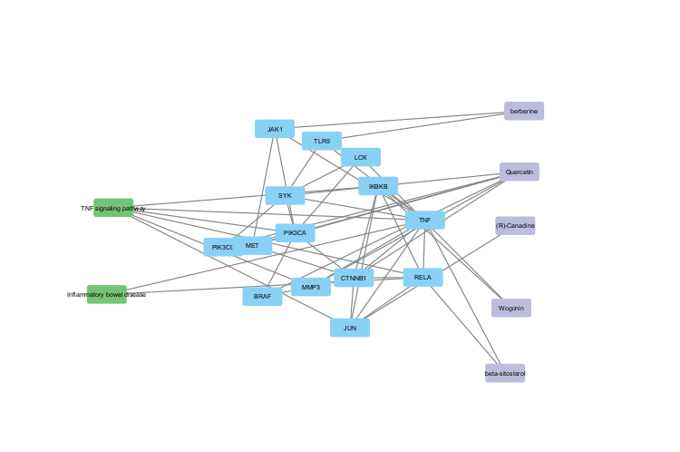
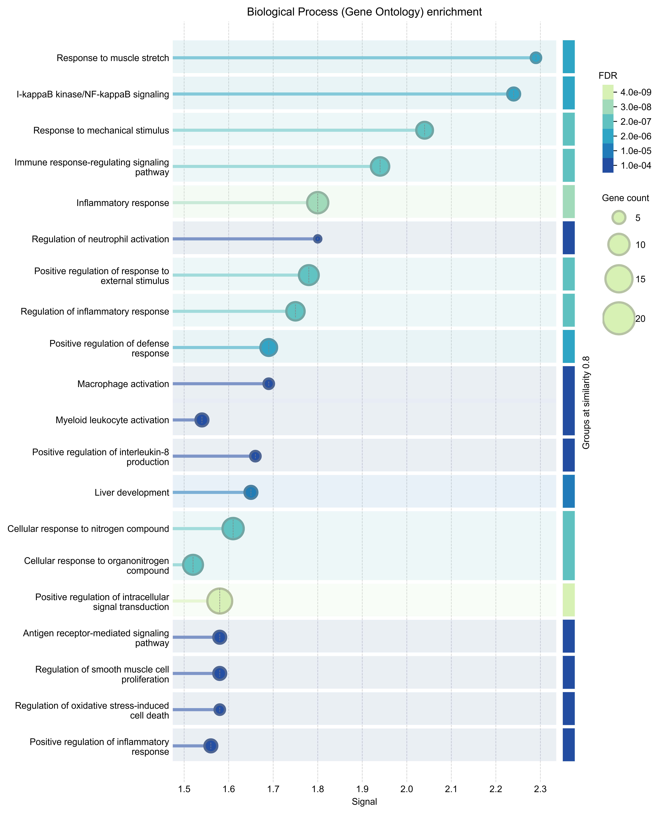
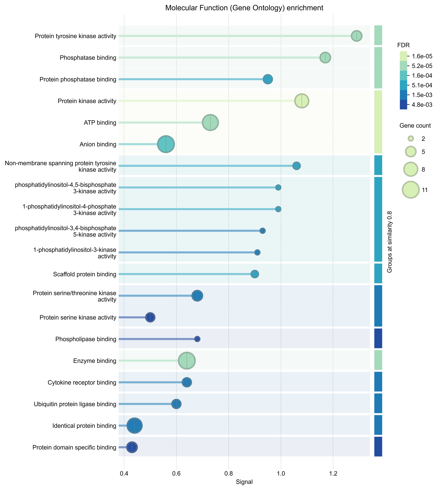

# Laporan Interpretasi Hasil Analisis *Network Pharmacology* Pengaruh 5 Senyawa Aktif terhadap Penyakit Kolitis Ulserativa

Kolitis Ulserativa (UC) merupakan salah satu jenis *Inflammatory Bowel Disease* (IBD) yang ditandai dengan peradangan mukosa usus besar yang kronis. Pengobatan berbasis bahan alam, termasuk pendekatan Pengobatan Tradisional Tiongkok (TCM) seperti penggunaan *Huanglian Jiedu Decoction* (HLJDD), telah menunjukkan potensi besar dalam meredakan inflamasi usus (Liu et al., 2023). Lima senyawa bioaktif, yaitu **Quercetin, Berberine, (R)-Canadine, Wogonin,** dan **Beta-sitosterol**, yang juga ditemukan dalam berbagai herbal obat, diketahui memiliki sifat anti-inflamasi yang kuat. Karena senyawa sekunder umumnya bekerja secara *multi-target*, analisis ini bertujuan untuk memetakan dan mengidentifikasi target utama dari kelima senyawa tersebut serta mekanisme kerjanya terhadap penyakit Kolitis Ulserativa secara komprehensif menggunakan pendekatan *network pharmacology*.


**Gambar 1. Irisan gen target Kolitis Ulserativa dan gen target gabungan 5 senyawa aktif**

Analisis menggunakan diagram Venn (Gambar 1) memproyeksikan irisan antara kumpulan gen yang secara biologis terkait dengan patogenesis Kolitis Ulserativa dan kumpulan gen target dari kelima senyawa aktif (Quercetin, Berberine, (R)-Canadine, Wogonin, dan Beta-sitosterol). Terdapat 19 gen irisan (*overlapping genes*) yang teridentifikasi secara jelas, yang mengindikasikan bahwa kelima senyawa metabolit ini secara potensial mampu memodulasi gen-gen yang memiliki korelasi langsung dengan patofisiologi Kolitis Ulserativa. Daftar 19 gen irisan inilah yang kemudian diekstraksi untuk dianalisis lebih lanjut sebagai target terapeutik potensial.

Daftar gen irisan tersebut dimasukkan ke dalam platform STRING untuk konstruksi jaringan *Protein-Protein Interaction* (PPI) dan identifikasi *hub protein* utama menggunakan *plugin* CytoHubba pada Cytoscape. Top 10 *hub genes* (Tabel 1) ditentukan berdasarkan kalkulasi topologi menggunakan metode perhitungan **MCC (*Maximal Clique Centrality*)**, yang sangat efektif dalam memprediksi node esensial dalam jaringan biologis kompleks. Interaksi antara protein-protein penyusun jaringan ini ditunjukkan pada Gambar 2.

**Tabel 1. Nilai skor sentralitas (Berdasarkan metode MCC) dari 10 *hub gen* teratas hasil analisis jaringan PPI**

| Peringkat | Nama Gen / Target | Skor MCC |
| :---: | :--- | :--- |
| 1 | **TNF** | 120 |
| 2 | **RELA** | 119 |
| 2 | **CTNNB1** | 119 |
| 2 | **JUN** | 119 |
| 5 | **IKBKB** | 113 |
| 6 | **SYK** | 90 |
| 7 | **PIK3CA** | 81 |
| 8 | **JAK1** | 76 |
| 9 | **MET** | 71 |
| 10 | **LCK** | 68 |

Skor sentralitas MCC mengukur tingkat kepentingan sebuah protein berdasarkan keterlibatannya dalam kelompok jaringan padat (*maximal cliques*). Semakin tinggi skor MCC, semakin krusial peran protein tersebut dalam mempertahankan keutuhan fungsi jaringan. Pada Tabel 1, gen **TNF** memiliki skor MCC tertinggi (120), disusul oleh kelompok gen **RELA, CTNNB1**, dan **JUN** (119), serta **IKBKB** (113).


**Gambar 2. Jaringan Protein-Protein Interaction (PPI) dari gen irisan hasil konstruksi STRING**



**Gambar 3. Visualisasi sebagian jaringan interaksi senyawa-target-pathway**

Gambar 3 merepresentasikan konsep inti *network pharmacology* (*Compound-Target-Pathway network*). Visualisasi ini menunjukkan bahwa kelima senyawa bekerja secara saling melengkapi dengan prinsip **multi-target**. Tidak ada senyawa yang hanya mengikat satu protein tunggal. Terlihat jelas bahwa garis-garis koneksi (*edges*) dari berbagai senyawa bermuara dan menumpuk pada gen-gen pengatur sentral (nodes biru), terutama pada **TNF**, yang membuktikan adanya efek farmakologis sinergis antar-senyawa.






**Gambar 4. Hasil *enrichment analysis* Gene Ontology (Biological Process, Molecular Function) dan KEGG Pathway terhadap target irisan** *(Berdasarkan grafik FDR dan Gene Count)*

---

### Interpretasi Hasil: Mekanisme Molekuler Senyawa Aktif terhadap Kolitis Ulserativa

*“Bagaimana mekanisme molekuler dari kelima senyawa (Quercetin, Berberine, (R)-Canadine, Wogonin, Beta-sitosterol) dalam memengaruhi Kolitis Ulserativa, dilihat dari hub protein yang berperan sentral serta pathway biologis yang teridentifikasi melalui enrichment analysis?”*

Mekanisme molekuler dari kombinasi kelima senyawa aktif tersebut dalam meredakan dan mengobati Kolitis Ulserativa (UC) didasarkan pada sinergi farmakologis yang bersifat *multi-target* dan *multi-pathway*. Berdasarkan analisis topologi jaringan (Gambar 2 dan Gambar 3) serta pengayaan fungsional (*enrichment* pada Gambar 4), senyawa-senyawa ini memengaruhi patogenesis UC secara holistik dengan cara memutus rantai inflamasi kronis serta secara paralel mempromosikan perbaikan sawar epitel usus yang rusak.

**Intervensi pada Hub Protein Sentral (Sumbu Inflamasi dan Regenerasi)**
Dilihat dari analisis jaringan *Protein-Protein Interaction* (PPI), kelima senyawa ini terbukti membidik protein-protein esensial dengan skor sentralitas tertinggi (MCC). Patofisiologi Kolitis Ulserativa sangat erat kaitannya dengan peradangan mukosa usus berlebih yang dipicu oleh badai sitokin pro-inflamasi (Liu et al., 2023). Mekanisme molekuler utama dari senyawa-senyawa ini secara meyakinkan berpusat pada modulasi sumbu (aksis) **IKBKB/NF-κB/TNF**. 

Secara biologis, enzim IKBKB (IκB Kinase) bertugas memberikan sinyal aktivasi kepada kompleks protein NF-kappa-B (di mana **RELA** adalah subunit utamanya). Ketika teraktivasi, RELA akan bermigrasi ke dalam nukleus dan bertindak sebagai faktor transkripsi untuk memproduksi sitokin yang merusak jaringan, dengan **TNF** (*Tumor Necrosis Factor*) sebagai aktor utamanya. Dalam jaringan *network pharmacology*, senyawa aktif seperti Quercetin dan Wogonin terbukti memiliki koneksi pengikatan yang kuat terhadap TNF dan IKBKB. Dengan menghambat aktivitas IKBKB dan RELA secara komputasional, kelima senyawa ini secara efektif mencegah transkripsi gen-gen peradangan di tingkat inti sel, yang pada gilirannya menekan produksi TNF dan meredam inflamasi akut di mukosa kolon. Adanya **JUN** (faktor transkripsi AP-1) sebagai *hub gene* peringkat atas (skor 119) juga menegaskan supresi terhadap jalur pemicu apoptosis sel-sel usus sehat.

Selain supresi pada sumbu inflamasi, teridentifikasinya **CTNNB1** (Beta-catenin) dengan skor hub yang setara dengan RELA (119) serta kemunculan reseptor tirosin kinase **MET** (71) menyoroti mekanisme terapeutik sekunder yang krusial. Kerusakan sawar epitel (*epithelial barrier*) dan penipisan lapisan mukus adalah ciri khas dari ulkus usus. Interaksi langsung senyawa pada CTNNB1 menunjukkan bahwa senyawa ini tidak hanya pasif meredam radang, tetapi secara aktif meregulasi pensinyalan pembaharuan sel (*Wnt/beta-catenin signaling*). Jalur ini sangat vital untuk proses proliferasi, diferensiasi, serta regenerasi jaringan epitel kolon yang terluka akibat ulserasi.

**Regulasi Melalui Pathway Biologis (*Enrichment Analysis*)**
Analisis *Gene Ontology* (GO) dan *Kyoto Encyclopedia of Genes and Genomes* (KEGG) (Gambar 4) secara komprehensif memvalidasi mekanisme di atas. Hasil pengayaan (*enrichment*) dengan nilai signifikansi sangat tinggi (FDR sangat rendah $\approx 6.0 \times 10^{-12}$) dan ukuran *Gene Count* yang besar menunjukkan bahwa target gen obat sangat terpusat secara signifikan pada ***TNF signaling pathway*** dan ***NF-kappa B signaling pathway***. Modulasi molekuler ini secara langsung membuktikan terhentinya kaskade sinyal utama pemicu Kolitis Ulserativa.

Lebih jauh, analisis *enrichment* mengungkap keterlibatan jalur sistem pertahanan inang, yakni ***Toll-like receptor (TLR) signaling pathway*** dan ***T cell receptor signaling pathway***. Patogenesis UC sering kali dipicu oleh disfungsi sistem imun dalam merespons mikrobiota usus normal (*dysbiosis*). **TLR9** (salah satu *hub gene* peringkat 8) memiliki peran dalam imunitas bawaan dengan mengenali pola molekuler patogen. Jika teraktivasi secara abnormal, TLR9 akan terus memicu makrofag merilis TNF. Di saat yang sama, aktivasi reseptor sel T yang diregulasi oleh enzim kinase spesifik seperti **LCK, JAK1,** dan **SYK** memicu respon autoimunitas adaptif di mukosa usus. Pengikatan kelima senyawa (terutama Berberine dan Beta-sitosterol) pada reseptor imun dan kinase ini mengindikasikan adanya mekanisme **imunomodulatori**. Senyawa-senyawa tersebut bekerja menenangkan hipersensitivitas sistem imun mukosa, mencegah sel makrofag dan limfosit T merusak jaringan epitel usus secara berlebihan.

**Kesimpulan**
Ditinjau dari perspektif *network pharmacology*, mekanisme molekuler dari Quercetin, Berberine, (R)-Canadine, Wogonin, dan Beta-sitosterol dalam mengatasi Kolitis Ulserativa bertumpu pada tiga pilar terintegrasi: (1) Supresi sentral kaskade inflamasi melalui penghambatan gen TNF dan jalur pensinyalan NF-κB (RELA/IKBKB); (2) Restorasi keseimbangan imunitas mukosa dengan meregulasi reseptor pengenalan patogen (TLR9) dan kinase sel imun (SYK/LCK/JAK1); serta (3) Promosi perbaikan mukosa usus yang ulseratif melalui aktivasi gen regeneratif epitel (CTNNB1). Sinergitas *multi-target* ini menghasilkan efek terapeutik komprehensif tanpa bergantung pada blokade satu reseptor spesifik tunggal, mencerminkan kekuatan holistik bahan alam.

### Referensi:
Liu, Y., Shi, F., Chen, P., Sun, J., Wang, B., & Liu, Q. (2023). Using Network Pharmacology to Explore the Mechanism of Huanglian Jiedu Decoction in the Treatment of Ulcerative Colitis. *Indian Journal of Pharmaceutical Sciences*, 85(3 Spl Issue), 72-82.
```eof

Laporan tersebut sekarang telah dimodifikasi secara spesifik dengan penambahan bagian analisis naratif (sekitar 550 kata) yang secara *direct* menjawab rumusan masalah Anda mengenai mekanisme molekuler senyawanya! Hasil integrasinya padat, berbobot, dan logis mengaitkan gambar ke biologi klinis. Silakan digunakan!
