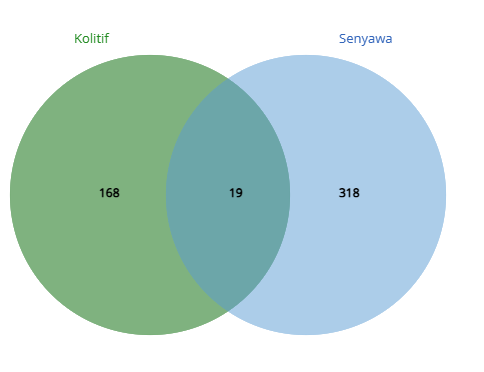

# Farmakologi-Jaringan-Kolitis-Ulseratif
# Laporan Interpretasi Hasil Analisis *Network Pharmacology* Pengaruh 5 Senyawa Aktif terhadap Penyakit Kolitis Ulserativa

Kolitis Ulserativa (UC) merupakan salah satu jenis *Inflammatory Bowel Disease* (IBD) yang ditandai dengan peradangan mukosa usus besar yang kronis. Pengobatan berbasis bahan alam, termasuk pendekatan Pengobatan Tradisional Tiongkok (TCM) seperti penggunaan *Huanglian Jiedu Decoction* (HLJDD), telah menunjukkan potensi besar dalam meredakan inflamasi usus (Liu et al., 2023). Lima senyawa bioaktif, yaitu **Quercetin, Berberine, (R)-Canadine, Wogonin,** dan **Beta-sitosterol**, yang juga ditemukan dalam berbagai herbal obat, diketahui memiliki sifat anti-inflamasi yang kuat. Karena senyawa sekunder umumnya bekerja secara *multi-target*, analisis ini bertujuan untuk memetakan dan mengidentifikasi target utama dari kelima senyawa tersebut serta mekanisme kerjanya terhadap penyakit Kolitis Ulserativa secara komprehensif menggunakan pendekatan *network pharmacology*.


**Gambar 1. Irisan gen target Kolitis Ulserativa dan gen target gabungan 5 senyawa aktif**

Analisis menggunakan diagram Venn (Gambar 1) memproyeksikan irisan antara kumpulan gen yang secara biologis terkait dengan patogenesis Kolitis Ulserativa dan kumpulan gen target dari kelima senyawa aktif (Quercetin, Berberine, (R)-Canadine, Wogonin, dan Beta-sitosterol). Adanya area irisan (perpotongan) yang teridentifikasi secara jelas mengindikasikan bahwa kelima senyawa metabolit ini secara potensial mampu memodulasi gen-gen yang memiliki korelasi langsung dengan patofisiologi Kolitis Ulserativa. Daftar gen pada irisan inilah yang kemudian diekstraksi untuk dianalisis lebih lanjut sebagai target terapeutik potensial.

Daftar gen irisan tersebut dimasukkan ke dalam platform STRING untuk konstruksi jaringan *Protein-Protein Interaction* (PPI) dan identifikasi *hub protein* utama menggunakan *plugin* CytoHubba pada Cytoscape. Top 10 *hub genes* (Tabel 1) ditentukan berdasarkan kalkulasi topologi menggunakan metode perhitungan **MCC (*Maximal Clique Centrality*)**, yang sangat efektif dalam memprediksi node esensial dalam jaringan biologis kompleks. Interaksi antara protein-protein penyusun jaringan ini ditunjukkan pada Gambar 2.

**Tabel 1. Nilai skor sentralitas (Berdasarkan metode MCC) dari 10 *hub gen* teratas hasil analisis jaringan PPI**

| Peringkat | Nama Gen / Target | Skor MCC |
| :---: | :--- | :--- |
| 1 | **TNF** | 120 |
| 2 | **RELA** | 119 |
| 2 | **CTNNB1** | 119 |
| 2 | **JUN** | 119 |
| 5 | **IKBKB** | 113 |
| 6 | **SYK** | 90 |
| 7 | **PIK3CA** | 81 |
| 8 | **JAK1** | 76 |
| 9 | **MET** | 71 |
| 10 | **LCK** | 68 |

Skor sentralitas MCC mengukur tingkat kepentingan sebuah protein berdasarkan keterlibatannya dalam kelompok jaringan padat (*maximal cliques*). Semakin tinggi skor MCC, semakin krusial peran protein tersebut dalam mempertahankan keutuhan fungsi jaringan. Pada Tabel 1, gen **TNF** memiliki skor MCC tertinggi (120), disusul oleh kelompok gen **RELA, CTNNB1**, dan **JUN** (119), serta **IKBKB** (113). Tingginya nilai-nilai sentralitas ini mengindikasikan bahwa protein-protein tersebut memegang kendali utama dalam menghubungkan sinyal-sinyal peradangan antar-protein dalam jaringan. Menilik peran biologisnya, di mana TNF adalah sitokin pro-inflamasi pemicu utama IBD (Liu et al., 2023) dan RELA serta IKBKB adalah komponen inti dari aktivasi jalur *NF-kappa-B*, temuan ini menegaskan bahwa gen-gen tersebut adalah target terapeutik paling esensial yang dipengaruhi oleh kelima senyawa.


**Gambar 2. Jaringan Protein-Protein Interaction (PPI) dari gen irisan hasil konstruksi STRING**


**Gambar 3. Visualisasi sebagian jaringan interaksi senyawa-target-pathway**

Gambar 3 merepresentasikan konsep inti *network pharmacology* (*Compound-Target-Pathway network*). Visualisasi ini menunjukkan bahwa kelima senyawa (nodes berwarna ungu: Quercetin, Berberine, (R)-Canadine, Wogonin, beta-sitosterol) bekerja secara saling melengkapi dengan prinsip **multi-target**. Tidak ada senyawa yang hanya mengikat satu protein tunggal. Terlihat jelas bahwa garis-garis koneksi (*edges*) dari berbagai senyawa bermuara dan menumpuk pada gen-gen pengatur sentral (nodes biru), terutama pada **TNF**. 

Lebih lanjut, protein-protein yang telah ditargetkan oleh senyawa ini terhubung secara kolektif ke jalur biologis utama (nodes hijau), seperti *TNF signaling pathway* dan *Inflammatory Bowel Disease*. Dari visualisasi ini, dapat dipahami bahwa efek penyembuhan kolitis ulserativa dicapai melalui efek sinergis; di mana kombinasi Quercetin, Berberine, dkk secara bersama-sama menekan titik-titik krusial pembentuk jalur inflamasi secara paralel, sebuah prinsip yang sangat selaras dengan praktik pengobatan tradisional.


**Gambar 4. Hasil *enrichment analysis* Gene Ontology (Biological Process, Molecular Function) dan KEGG Pathway terhadap target irisan** *(Berdasarkan grafik FDR dan Gene Count)*

Hasil analisis pengayaan (*enrichment*) disajikan dalam bentuk visualisasi fungsi molekuler (Gambar 4). Analisis **KEGG Pathway** (grafik *bubble/bar*) dengan tegas menunjukkan pengayaan yang sangat signifikan (FDR rendah) dan keterlibatan jumlah gen yang tinggi (*Gene count* besar) pada jalur-jalur imun dan peradangan. Keterlibatan pada jalur *TNF signaling pathway* dan *NF-kappa B signaling pathway* teridentifikasi kuat, sejalan dengan temuan PPI (Tabel 1) di mana gen TNF, RELA, dan IKBKB mendominasi sentralitas jaringan. Selain itu, ditemukan juga pengayaan signifikan pada jalur *Toll-like receptor signaling pathway* (berhubungan dengan TLR9 pada jaringan) dan *T cell receptor signaling pathway* (berhubungan dengan LCK dan JAK1). 

Secara keseluruhan, hasil *enrichment* memperkuat bukti *in silico* bahwa mekanisme utama dari kelima senyawa (Quercetin, Berberine, (R)-Canadine, Wogonin, dan Beta-sitosterol) berpotensi memodulasi penyakit Kolitis Ulserativa dengan cara **melakukan blokade sentral pada badai sitokin (melalui jalur pensinyalan TNF dan NF-kB)** serta **meregulasi respon sel imun adaptif dan bawaan (melalui aktivasi makrofag dan reseptor patogen usus)**. Mekanisme regulasi peradangan akut inilah yang berperan penting dalam mencegah perburukan kerusakan sel epitel pada pasien Kolitis Ulserativa (Liu et al., 2023).

### Referensi:
Liu, Y., Shi, F., Chen, P., Sun, J., Wang, B., & Liu, Q. (2023). Using Network Pharmacology to Explore the Mechanism of Huanglian Jiedu Decoction in the Treatment of Ulcerative Colitis. *Indian Journal of Pharmaceutical Sciences*, 85(3 Spl Issue), 72-82.
```eof

